# 📊 ABCD Bank Customer Onboarding and AI LLM-Enhanced CDD Risk Scoring

This repository contains a Streamlit-based application for customer onboarding and Customer Due Diligence (CDD) risk scoring for ABCD Bank, leveraging AI Large Language Models (LLMs) for enhanced document validation and risk assessment. The application consists of two main components:

1. **Customer Onboarding (**`onboard.py`**)**: A form to collect customer information, upload identification and income verification documents, and validate them using an AI LLM (Ollama's `llava:7b` model) before storing data in a SQLite database.
2. **CDD Risk Scoring (**`cdd.py`**)**: A risk assessment tool that calculates customer risk scores using an XGBoost model for structured data and an LLM (`granite3.2:latest` via Ollama) for unstructured income comments, providing a comprehensive risk profile with advanced filtering and visualization.

## ✨ Features

### 🧑‍💼 Customer Onboarding

- ✅ **Personal Information**: Collects details such as name, residence country, occupation, and customer type.
- 📍 **Address Information**: Captures street address, city, state, and postal code.
- 💰 **Source of Income**: Records income source, comments, and expected transaction volume.
- 📤 **Document Upload**: Supports images (PNG, JPG, JPEG) and PDFs for identification (e.g., passport, driver's license, national ID) and income verification.
- 🤖 **AI LLM Document Validation**: Uses Ollama's `llava:7b` vision-language model to identify document types and provide descriptive metadata (e.g., "The image appears to show a passport, which is an official document...").
- 💾 **Database Storage**: Stores customer data, file paths, and LLM-generated descriptions in a SQLite database (`bank_onboarding.db`).
- 🖼️ **UI**: Tabbed interface with custom CSS for a professional and user-friendly experience.

### 📈 CDD Risk Scoring

- 🔍 **Customer Filtering**: Filter customers by country, customer type, or search by name/ID.
- ⚖️ **Risk Assessment**:
  - **Structured Risk**: Uses an XGBoost model trained on synthetic data to compute a base risk score (0–375) based on structured fields like residence country, customer type, occupation, time at address, and income source.
  - **Unstructured Risk**: Enhances the base score with an LLM (`granite3.2:latest`) analysis of unstructured income comments, adding up to 50 points for a total score of 0–425.
- 🧠 **AI LLM Risk Adjustment**: The LLM evaluates income comments for stability, legitimacy, and clarity, providing a risk adjustment score and explanation (e.g., "Risk Adjustment: 20, Explanation: Freelance income lacks detailed documentation...").
- 📊 **Risk Visualization**: Displays risk scores, categories (Low, Medium, High), and a color-coded progress bar (green for low, orange for medium, red for high).
- 📉 **Risk Factor Analysis**: Visualizes individual risk contributions from country, customer type, occupation, address stability, and income source using color-coded bars.
- 📜 **Document Text Extraction**: Extracts text from uploaded PDFs for review, aiding in manual verification.
- 🖥️ **UI**: Card-based layout with custom CSS for clear, interactive presentation of customer details and risk metrics.

## 🧠 AI LLM Integration

### Customer Onboarding

- **Document Validation with** `llava:7b`:
  - The `llava:7b` model, a vision-language LLM, processes uploaded images and PDFs to identify document types (e.g., passport, driver's license, national ID, income).
  - It generates concise descriptions, such as "The image appears to show a national ID card, specifically an Indian Aadhaar card...".
  - For PDFs, the application extracts images or page snapshots and validates each using the LLM, ensuring consistency in multi-page documents.
  - **Benefits**:
    - 🚀 Automates document classification, reducing manual effort.
    - 🎯 Enhances accuracy by recognizing specific document features (e.g., biometric identifiers in national IDs).
    - 📋 Provides descriptive metadata for audit trails.

### CDD Risk Scoring

- **Risk Adjustment with** `granite3.2:latest`:

  - The `granite3.2:latest` LLM analyzes unstructured income comments to assess risk factors like income stability, legitimacy, and clarity.

  - It generates a risk adjustment score (0–50 points) and a detailed explanation, formatted as:

    ```
    Risk Adjustment: 20
    Explanation: The comment mentions freelance work, which introduces variability in income stability, warranting a moderate risk increase.
    ```

  - The adjustment is added to the XGBoost base score, creating a more holistic risk profile.

  - **Benefits**:

    - 🔎 Captures nuanced risks in unstructured text that structured data models like XGBoost cannot assess.
    - 📝 Provides explainability, critical for regulatory compliance and auditability.
    - 🌐 Enhances risk scoring by incorporating qualitative insights from income comments.

## ⚖️ CDD Risk Scoring Logic with LLM Enhancement

### Structured Risk (XGBoost)

- **Inputs**: Residence country, customer type, occupation, time at address, income source.
- **Process**:
  1. Data is encoded using `LabelEncoder` for categorical variables.
  2. An XGBoost regressor, trained on synthetic data, predicts a base risk score (0–375).
  3. The score reflects patterns in structured data, e.g., higher risk for offshore countries or unstable addresses.
- **Output**: A numerical score and risk category (Low: <100, Medium: 100–250, High: >250).

### Unstructured Risk (LLM Enhancement)

- **Input**: Income comments (e.g., "Customer claims income from freelance work and occasional consulting").
- **Process**:
  1. A prompt is sent to `granite3.2:latest` via Ollama, asking for a risk adjustment score (0–50) and explanation based on income comment analysis.
  2. The LLM evaluates:
     - **Stability**: Is the income source consistent (e.g., employment vs. freelance)?
     - **Legitimacy**: Does the comment suggest verifiable income (e.g., documented vs. vague sources)?
     - **Clarity**: Is the comment detailed or ambiguous?
  3. The LLM returns a structured response, parsed to extract the adjustment score and explanation.
  4. The adjustment is added to the XGBoost base score, with a maximum total score of 425.
- **Output**: Total score, risk category (Low: <100, Medium: 100–250, High: >250), and LLM explanation.
- **Fallback**: If the LLM fails (e.g., connection error), the adjustment is 0, and an error message is provided.

### Risk Factor Analysis

- **Components**:
  - 🌍 **Country Risk**: Higher for Russia or offshore centers (25 points) vs. others (10 points).
  - 🏢 **Customer Type Risk**: Higher for trusts/partnerships (20 points) vs. individuals/companies (5 points).
  - 💼 **Occupation Risk**: Higher for government/political or unknown roles (15 points) vs. others (5 points).
  - 🏠 **Address Stability Risk**: Higher for <1 year at address (20 points) vs. longer (5 points).
  - 💸 **Income Source Risk**: Higher for inheritance/gift or other (20 points) vs. employment/business (5 points).
- **Visualization**: Each factor is displayed with a color-coded bar (green: low, orange: medium, red: high) proportional to its risk contribution.

### LLM Enhancement Benefits

- 🧩 **Holistic Risk Assessment**: Combines quantitative (XGBoost) and qualitative (LLM) analyses for a more accurate risk profile.
- 🕵️‍♂️ **Contextual Understanding**: The LLM interprets nuanced text, identifying risks like unstable income sources that structured models miss.
- 📖 **Explainability**: LLM explanations provide transparency, aiding compliance with anti-money laundering (AML) and know-your-customer (KYC) regulations.
- 🔄 **Adaptability**: The LLM can handle diverse income comments, making the system robust to varied customer profiles.

## 🖥️ System Design

### System Design Diagram

Below is a Mermaid diagram illustrating the system architecture and data flow with emoji-based icons:

```mermaid
graph TD
    A[User Interface 🎨 <br> Streamlit] -->|Onboarding Input| B[Customer Onboarding 📝 <br> onboard.py]
    A -->|Risk Scoring Request| C[CDD Risk Scoring ⚖️ <br> cdd.py]

    %% Customer Onboarding Flow
    B -->|Collects Data| D[Customer Data 📇]
    B -->|Uploads Documents| E[Document Files 📄]
    B -->|Calls API| F[Ollama LLM 👁️ <br> llava:7b]
    F -->|Document Type & Description| B
    B -->|Saves Data| G[SQLite Database 💾 <br> bank_onboarding.db]
    B -->|Saves Files| H[Images Directory 📂]

    %% CDD Risk Scoring Flow
    C -->|Queries Data| G
    C -->|Structured Risk| I[XGBoost Model ⚙️]
    C -->|Unstructured Risk| J[Ollama LLM 🧠 <br> granite3.2:latest]
    J -->|Risk Adjustment & Explanation| C
    C -->|Displays Results| A

    %% Data Storage
    G -->|Customer Records| C
    H -->|Document Files| C

    %% External Dependencies
    F -->|Localhost:11434| K[Ollama Server 🖥️]
    J -->|Localhost:11434| K
```



### Explanation of System Design

The system is designed to handle two primary workflows: **Customer Onboarding** and **CDD Risk Scoring**, integrated with AI LLMs for document validation and risk assessment. Below is a detailed breakdown of each component and its interactions:

#### 1. **User Interface (Streamlit)** 🎨

- **Role**: The front-end interface, built using Streamlit, provides an interactive web application for users to input data, upload documents, and view risk scoring results.
- **Functionality**:
  - In `onboard.py`: Offers a tabbed interface with fields for personal information, address, income details, and document uploads. Custom CSS enhances the visual appeal with headers, cards, and color-coded elements.
  - In `cdd.py`: Displays a customer search and filter interface, customer details in cards, and risk assessment results with visualizations (e.g., risk bars, badges).
- **Interactions**:
  - Users submit customer data and documents via the onboarding form.
  - Users select customers and trigger risk scoring (structured or unstructured) in the CDD module.
  - Results are rendered back to the UI with visual elements like progress bars and risk category badges.

#### 2. **Customer Onboarding (onboard.py)** 📝

- **Role**: Manages the collection, validation, and storage of customer data and documents.
- **Functionality**:
  - **Data Collection**: Captures customer details (e.g., name, residence country, occupation) and income information via form inputs.
  - **Document Upload**: Accepts images (PNG, JPG, JPEG) and PDFs, storing them in the `images` directory with filenames based on a generated customer ID (MD5 hash of first name + surname) and document type.
  - **Document Validation**: Uses the `llava:7b` LLM to identify document types (e.g., passport, driver's license) and generate descriptions. For PDFs, it extracts images or page snapshots for validation.
  - **Database Storage**: Saves customer data, file paths, and LLM-generated descriptions to the SQLite database (`bank_onboarding.db`).
- **Interactions**:
  - Receives user input from the Streamlit UI.
  - Sends document images/PDFs to the Ollama server for validation.
  - Stores validated data and file paths in the SQLite database and `images` directory.
  - Displays validation results (e.g., document type, description) in the UI.

#### 3. **CDD Risk Scoring (cdd.py)** ⚖️

- **Role**: Performs risk assessment using structured (XGBoost) and unstructured (LLM) analyses, displaying results with visualizations.
- **Functionality**:
  - **Customer Filtering**: Queries the SQLite database to fetch customer records, allowing filtering by country, customer type, or search by name/ID.
  - **Structured Risk Scoring**: Uses an XGBoost regressor trained on synthetic data to compute a base risk score (0–375) based on structured fields (e.g., residence country, occupation).
  - **Unstructured Risk Scoring**: Enhances the base score with an LLM (`granite3.2:latest`) analysis of income comments, adding up to 50 points for a total score of 0–425.
  - **Risk Visualization**: Displays scores, risk categories (Low, Medium, High), and factor-specific risks (e.g., country, occupation) with color-coded bars.
  - **Document Text Extraction**: Extracts text from uploaded PDFs for display, aiding manual verification.
- **Interactions**:
  - Queries the SQLite database for customer data.
  - Uses the XGBoost model for structured risk scoring.
  - Sends income comments to the Ollama server for LLM-based risk adjustment.
  - Retrieves document files from the `images` directory for text extraction.
  - Renders risk scores, explanations, and visualizations in the Streamlit UI.

#### 4. **Customer Data** 📇

- **Role**: Represents the structured data collected during onboarding (e.g., name, residence country, income source).
- **Storage**: Persisted in the SQLite database (`customers` table).
- **Interaction**:
  - Populated by the onboarding module.
  - Queried by the CDD module for risk scoring and display.

#### 5. **Document Files** 📄

- **Role**: Stores uploaded images and PDFs containing identification and income verification documents.
- **Storage**: Saved in the `images` directory with filenames like `<customer_id>_<doc_type>.<ext>`.
- **Interaction**:
  - Created by the onboarding module during document upload.
  - Accessed by the CDD module for text extraction from PDFs.

#### 6. **Ollama LLM (llava:7b)** 👁️

- **Role**: Vision-language model used for document validation in the onboarding module.
- **Functionality**:
  - Analyzes images and PDF-extracted images to identify document types (e.g., passport, national ID).
  - Generates descriptive metadata for each document.
- **Interaction**:
  - Called via API (`http://localhost:11434/api/generate`) by the onboarding module.
  - Returns document type and description to be stored in the database.

#### 7. **Ollama LLM (granite3.2:latest)** 🧠

- **Role**: Text-based LLM used for risk adjustment in the CDD module.
- **Functionality**:
  - Analyzes income comments to assess risk factors (stability, legitimacy, clarity).
  - Returns a risk adjustment score (0–50) and explanation.
- **Interaction**:
  - Called via API by the CDD module.
  - Returns adjustment and explanation for display in the UI.

#### 8. **SQLite Database (bank_onboarding.db)** 💾

- **Role**: Persistent storage for customer data, file paths, and LLM-generated descriptions.
- **Structure**: Single `customers` table with fields like `cid`, `first_name`, `income_comments`, `file_paths`, `descriptions`.
- **Interaction**:
  - Populated by the onboarding module during submission.
  - Queried by the CDD module for customer filtering and risk scoring.

#### 9. **Images Directory** 📂

- **Role**: File system storage for uploaded document files.
- **Interaction**:
  - Populated by the onboarding module.
  - Accessed by the CDD module for PDF text extraction.

#### 10. **XGBoost Model** ⚙️

- **Role**: Machine learning model for structured risk scoring in the CDD module.
- **Functionality**:
  - Trained on synthetic data with features like residence country, customer type, and occupation.
  - Predicts a base risk score (0–375).
- **Interaction**:
  - Used by the CDD module to compute structured risk scores.

#### 11. **Ollama Server** 🖥️

- **Role**: Hosts the `llava:7b` and `granite3.2:latest` LLMs, accessible via a local API (`http://localhost:11434`).
- **Interaction**:
  - Receives API requests from both onboarding and CDD modules.
  - Processes document images and text inputs, returning LLM outputs.

### Design Considerations

- **Modularity**: The system separates onboarding and risk scoring into distinct scripts, allowing independent development and maintenance.
- **Scalability**: SQLite and local file storage are suitable for small-scale use but may require a more robust database (e.g., PostgreSQL) and cloud storage for production.
- **AI Integration**: LLMs enhance automation (document validation) and risk assessment (unstructured data analysis), but their local deployment requires significant computational resources.
- **User Experience**: Streamlit's interactive UI with custom CSS ensures a professional and intuitive interface.
- **Error Handling**: Basic error handling is implemented for LLM API failures and database operations; production systems should enhance this.

This design aligns with the functionality in `onboard.py` and `cdd.py`, providing a clear flow from data collection to risk assessment with AI-driven enhancements.

## 🛠️ Prerequisites

- **Python 3.8+**

- **Ollama**: Running locally with `llava:7b` (for document validation) and `granite3.2:latest` (for risk adjustment) models.

- **SQLite**: Used for data storage (no separate installation required).

- **Dependencies**:

  - Install required Python packages:

    ```bash
    pip install streamlit pdfplumber pillow pandas numpy scikit-learn xgboost requests
    ```

## 🔧 Setup

1. **Clone the Repository**:

   ```bash
   git clone https://github.com/Logulokesh/LLM-Enhanced-CDD-Risk-Scoring.git
   cd LLM-Enhanced-CDD-Risk-Scoring
   ```

2. **Install Dependencies**:

   ```bash
   pip install -r requirements.txt
   ```

   Create a `requirements.txt` with:

   ```
   streamlit
   pdfplumber
   pillow
   pandas
   numpy
   scikit-learn
   xgboost
   requests
   ```

3. **Set Up Ollama**:

   - Install Ollama: Follow instructions at ollama.ai.

   - Pull required models:

     ```bash
     ollama pull llava:7b
     ollama pull granite3.2:latest
     ```

   - Start Ollama server:

     ```bash
     ollama serve
     ```

4. **Prepare Directory**:

   - Create an `images` folder in the project directory to store uploaded files.
   - Optionally, add a `logo.png` file in the project root for the onboarding UI.

## 🚀 Running the Application

1. **Customer Onboarding**:

   ```bash
   streamlit run onboard.py
   ```

   - Access at `http://localhost:8501`.
   - Fill in customer details, upload documents, and submit to validate and store in the database.

2. **CDD Risk Scoring**:

   ```bash
   streamlit run cdd.py
   ```

   - Access at `http://localhost:8501`.
   - Filter customers, select a customer, and calculate structured or LLM-enhanced unstructured risk scores.

## 💾 Database

- **File**: `bank_onboarding.db` (SQLite)
- **Table**: `customers`
- **Fields**: `cid`, `first_name`, `surname`, `residence_country`, `customer_type`, `occupation`, `time_at_address`, `street_address`, `city`, `state`, `postal_code`, `income_source`, `income_comments`, `expected_transaction_volume`, `file_paths`, `descriptions`, `created_at`

## 📝 Notes

- **Ollama Configuration**: Ensure Ollama is running at `http://localhost:11434`. Adjust `OLLAMA_API_URL` in both scripts if using a different host/port.
- **LLM Resource Requirements**: The `llava:7b` and `granite3.2:latest` models require significant computational resources (GPU recommended).
- **Risk Scoring**: The XGBoost model uses synthetic data. For production, train on real customer data.
- **File Storage**: Uploaded files are saved in the `images` directory with filenames based on customer ID and LLM-identified document type.
- **Security**: MD5 is used for customer ID generation (demo purposes). Use a cryptographically secure method in production.
- **Error Handling**: The application includes basic error handling for LLM failures; enhance for robustness in production.

## 🤝 Contributing

1. Fork the repository.
2. Create a feature branch (`git checkout -b feature/your-feature`).
3. Commit changes (`git commit -m 'Add your feature'`).
4. Push to the branch (`git push origin feature/your-feature`).
5. Open a pull request.


## Screenshots


### Customer Onboarding

#### Step 1


#### Step 2


#### Step 3


---

### CDD Risk Scoring

#### Step 1


#### Step 2


#### Step 3

